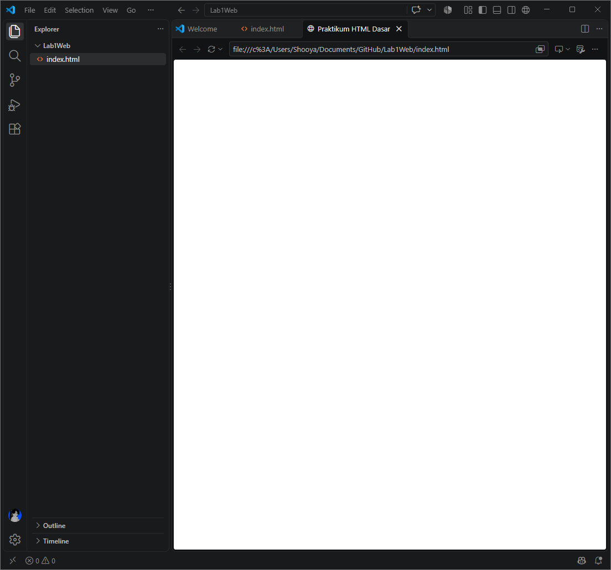
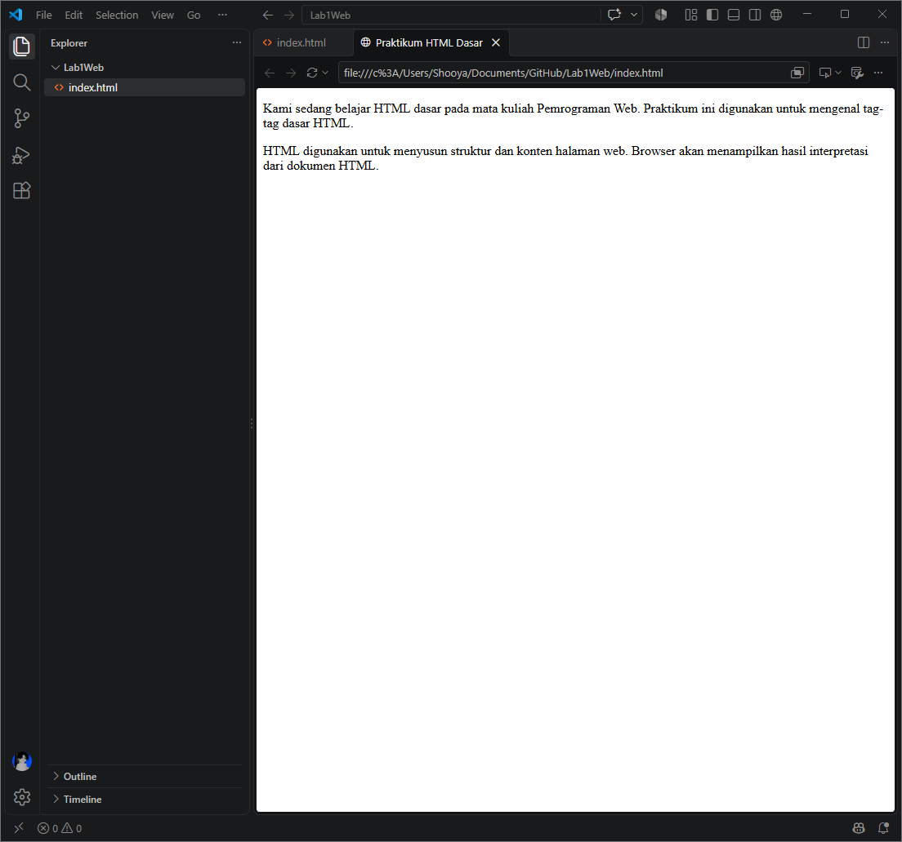
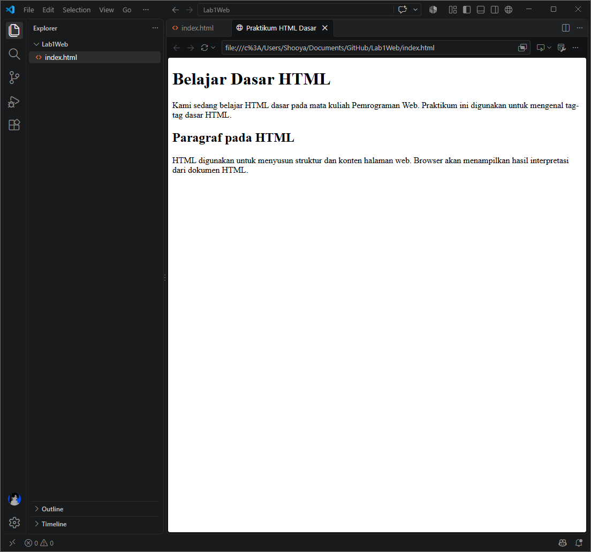
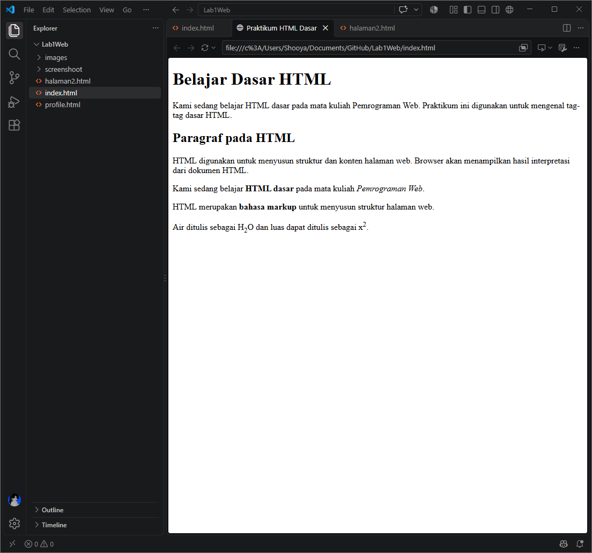
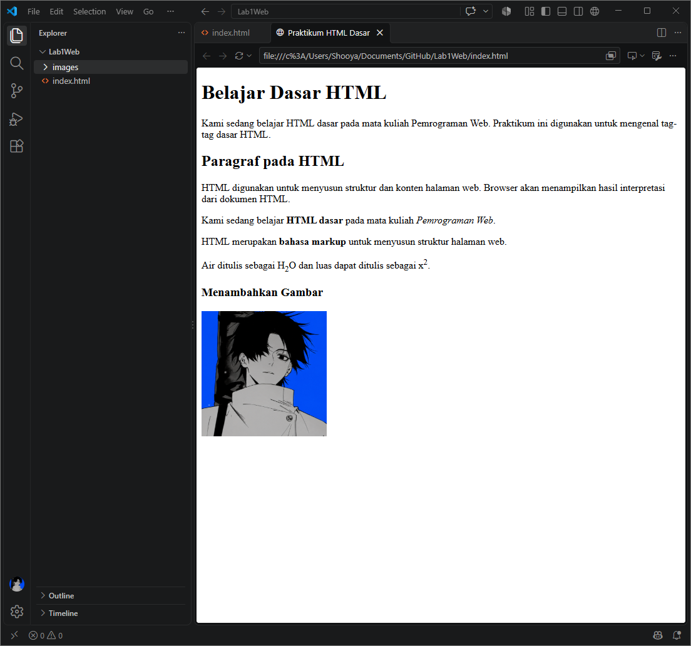
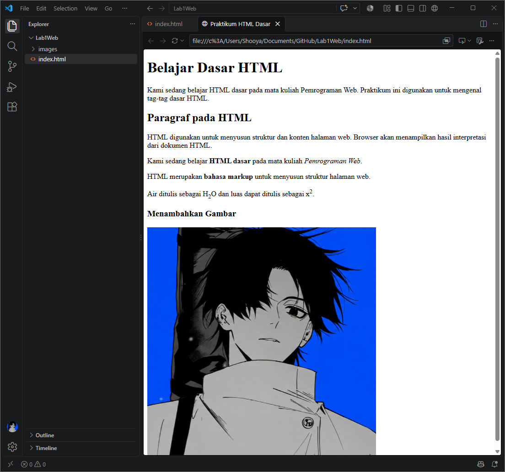
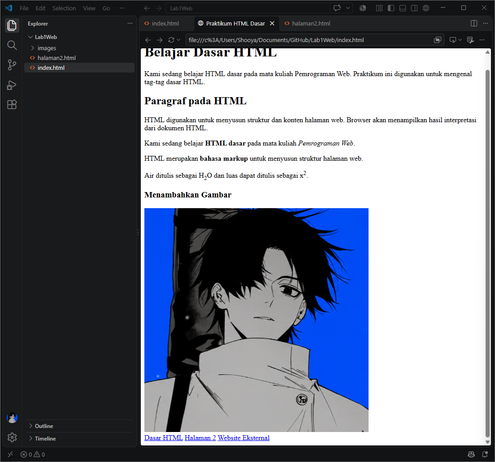
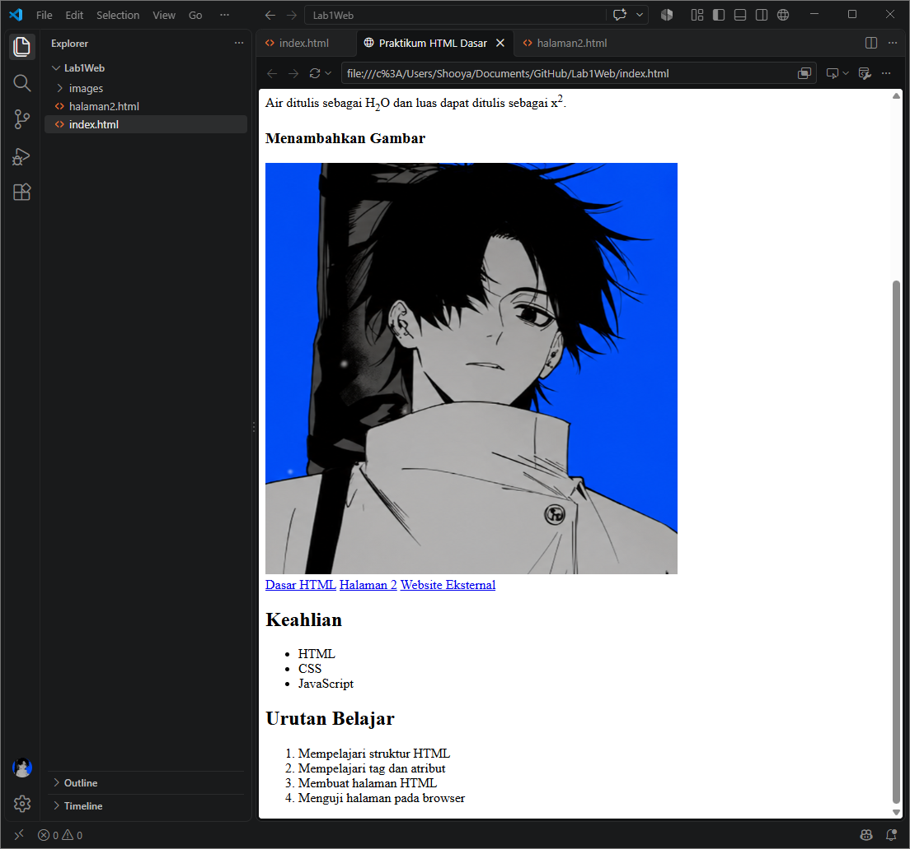
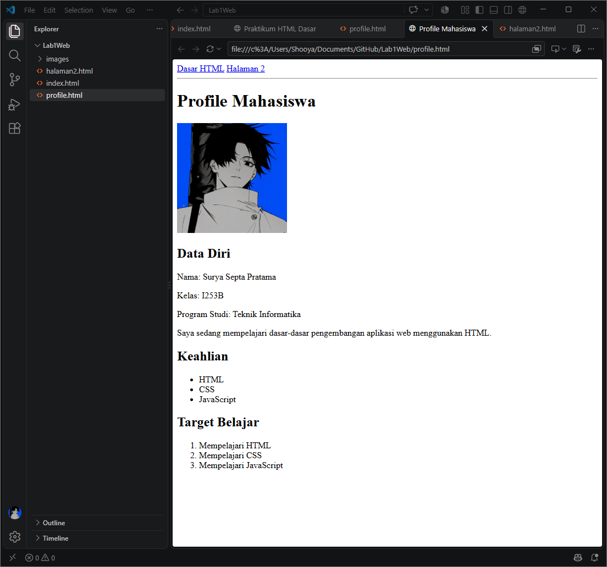

# Lab1Web

## Langkah 1: Menambahkan struktur dasar HTML

Saya membuat file `index.html` lalu menulis struktur dasar HTML berikut.

```html
<!DOCTYPE html>
<html>
    <head>
        <title>Praktikum HTML Dasar</title>
    </head>
    <body>
    </body>
</html>
```

Penjelasan: `<!DOCTYPE html>` menandakan dokumen HTML5. Tag `<head>` berisi informasi halaman, yaitu `<title>` yang tampil di tab browser. Tag `<body>` berisi konten yang tampil di halaman, tetapi masih kosong pada langkah ini.

Hasil:



Pada hasil, tab browser menampilkan judul "Praktikum HTML Dasar" (panah merah), sedangkan halaman masih kosong karena `<body>` belum diisi.

## Langkah 2: Menambahkan beberapa paragraf sederhana

Saya menambahkan dua paragraf di dalam `<body>` memakai tag `<p>`, lengkap dengan komentar.

```html
<!-- Ini adalah paragraf pertama -->
<p>
    Kami sedang belajar HTML dasar pada mata kuliah Pemrograman Web.
    Praktikum ini digunakan untuk mengenal tag-tag dasar HTML.
</p>

<!-- Ini adalah paragraf kedua -->
<p>
    HTML digunakan untuk menyusun struktur dan konten halaman web.
    Browser akan menampilkan hasil interpretasi dari dokumen HTML.
</p>
```

Penjelasan: Tag `<p>` membuat paragraf, dan setiap paragraf diberi jarak otomatis oleh browser. Teks di dalam `<!-- ... -->` adalah komentar yang tidak ditampilkan di browser.

Hasil:



Browser menampilkan dua paragraf, sedangkan komentar tidak muncul.

## Langkah 3: Menambahkan heading h1 dan h2

Saya menambahkan heading `<h1>` sebelum paragraf pertama dan `<h2>` sebelum paragraf kedua.

```html
<!-- judul utama -->
<h1>Belajar Dasar HTML</h1>

<!-- subjudul -->
<h2>Paragraf pada HTML</h2>
```

Penjelasan: `<h1>` dipakai sebagai judul utama halaman, sedangkan `<h2>` sebagai subjudul. Heading membuat struktur halaman lebih jelas dan mudah dibaca.

Hasil:



Teks "Belajar Dasar HTML" tampil paling besar sebagai judul utama, diikuti "Paragraf pada HTML" sebagai subjudul dengan ukuran lebih kecil.

## Langkah 4: Melakukan pemformatan teks

Saya memformat teks pada paragraf dengan tag `<b>`, `<i>`, `<strong>`, `<sub>`, dan `<sup>`.

```html
<p>
    Kami sedang belajar <b>HTML dasar</b> pada mata kuliah
    <i>Pemrograman Web</i>.
</p>

<p>
    HTML merupakan <strong>bahasa markup</strong> untuk menyusun
    struktur halaman web.
</p>

<p>
    Air ditulis sebagai H<sub>2</sub>O dan luas dapat ditulis
    sebagai x<sup>2</sup>.
</p>
```

Penjelasan:
- `<b>` membuat teks tebal dan `<i>` membuat teks miring.
- `<strong>` juga membuat teks tebal, tetapi menandakan teks tersebut penting.
- `<sub>` membuat teks subscript (turun) dan `<sup>` membuat teks superscript (naik).

Hasil:



"HTML dasar" tampil tebal, "Pemrograman Web" miring, "bahasa markup" tebal, angka 2 pada H2O tampil di bawah, dan angka 2 pada x2 tampil di atas.

## Langkah 5: Menyisipkan gambar

Saya menyimpan gambar di folder `images` dengan nama `profil.png`, lalu menyisipkannya dengan tag ``.

```html
<h3>Menambahkan Gambar</h3>

```

Penjelasan:
- `src` adalah lokasi file gambar.
- `width` mengatur lebar gambar (200 piksel).
- `alt` adalah teks pengganti jika gambar gagal dimuat.
- `title` adalah teks yang muncul saat kursor diarahkan ke gambar.

Hasil:



Gambar profil tampil di bawah heading "Menambahkan Gambar" dengan lebar 200 piksel.

## Langkah 6: Mengatur ukuran gambar

Saya mengubah nilai atribut `width` pada gambar dari 200 menjadi 500.

```html
<h3>Menambahkan Gambar</h3>

```

Penjelasan: Atribut `width` menentukan ukuran gambar. Jika hanya `width` yang diatur, tinggi gambar menyesuaikan otomatis sehingga proporsinya tetap terjaga.

Hasil:



Gambar tampil lebih besar dibandingkan langkah 5.

## Langkah 7: Membuat halaman2.html dan menambahkan hyperlink

Saya membuat file `halaman2.html` dan mengisinya dengan struktur dasar HTML. Kemudian saya menambahkan navigasi berisi hyperlink pada `index.html`.

```html
<!-- navigasi halaman -->
<nav>
    <a href="index.html">Dasar HTML</a>
    <a href="halaman2.html">Halaman 2</a>
    <a href="https://github.com/shooya-x">Website Eksternal</a>
</nav>
```

Penjelasan:
- `<nav>` adalah tag untuk area navigasi.
- `<a>` membuat hyperlink dan atribut `href` menentukan tujuan tautan.
- Dua link pertama adalah link internal ke halaman di website yang sama, sedangkan link ketiga adalah link eksternal ke website lain.

Hasil:



Tiga link navigasi tampil di halaman dan dapat diklik untuk berpindah halaman.

## Langkah 8: Menambahkan unordered list dan ordered list

Saya menambahkan daftar keahlian dengan `<ul>` dan daftar urutan belajar dengan `<ol>`.

```html
<h2>Keahlian</h2>
<ul>
    <li>HTML</li>
    <li>CSS</li>
    <li>JavaScript</li>
</ul>

<h2>Urutan Belajar</h2>
<ol>
    <li>Mempelajari struktur HTML</li>
    <li>Mempelajari tag dan atribut</li>
    <li>Membuat halaman HTML</li>
    <li>Menguji halaman pada browser</li>
</ol>
```

Penjelasan: `<ul>` membuat daftar tidak berurutan yang ditandai bullet, sedangkan `<ol>` membuat daftar berurutan yang ditandai angka. Setiap item daftar ditulis dengan tag `<li>`.

Hasil:



Daftar keahlian tampil dengan bullet, sedangkan urutan belajar tampil dengan nomor 1 sampai 4.

## Langkah 9: Membuat halaman profil

Saya membuat file `profile.html` dan mengisinya dengan data diri.

```html
<!DOCTYPE html>
<html>
    <head>
        <title>Profile Mahasiswa</title>
    </head>
    <body>
        <nav>
            <a href="index.html">Dasar HTML</a>
            <a href="halaman2.html">Halaman 2</a>
        </nav>

        <hr>

        <h1>Profile Mahasiswa</h1>
        

        <h2>Data Diri</h2>
        <p>Nama: Surya Septa Pratama</p>
        <p>Kelas: I253B</p>
        <p>Program Studi: Teknik Informatika</p>
        <p>Saya sedang mempelajari dasar-dasar pengembangan aplikasi
            web menggunakan HTML.</p>

        <h2>Keahlian</h2>
        <ul>
            <li>HTML</li>
            <li>CSS</li>
            <li>JavaScript</li>
        </ul>

        <h2>Target Belajar</h2>
        <ol>
            <li>Mempelajari HTML</li>
            <li>Mempelajari CSS</li>
            <li>Mempelajari JavaScript</li>
        </ol>
    </body>
</html>
```

Penjelasan: Halaman ini menggabungkan tag yang sudah dipelajari, yaitu navigasi, heading, gambar, paragraf, dan daftar. Tag `<hr>` membuat garis pemisah horizontal antara navigasi dan konten.

Hasil:



Halaman profil menampilkan navigasi, garis pemisah, foto profil, data diri, daftar keahlian, dan target belajar.
